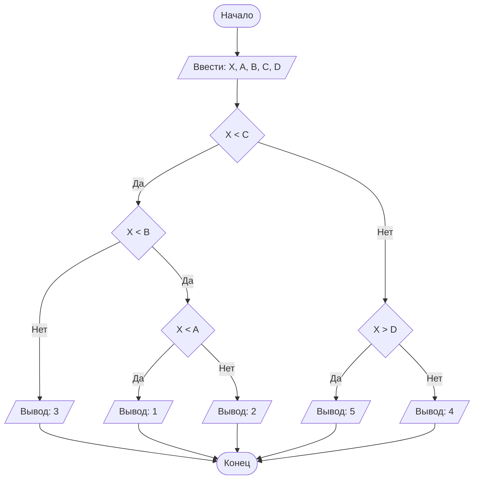

# Lab1
## Отчет по лабораторной работе № 1

#### № группы: `ПМ-2502`

#### Выполнил: `Ртищев Егор Андреевич`

#### Вариант: `19`

### Cодержание:

- [Постановка задачи](#1-постановка-задачи)
- [Входные и выходные данные](#2-входные-и-выходные-данные)
- [Выбор структуры данных](#3-выбор-структуры-данных)
- [Алгоритм](#4-алгоритм)
- [Программа](#5-программа)
- [Анализ правильности решения](#6-анализ-правильности-решения)

### 1. Постановка задачи

>На числовой прямой расположены 4 различные точки A, B, C, D (где A <
B < C < D), которые разбивают числовую прямую на 5 участков (1, 2, 3,
4, 5 слева направо). В какой из участков попадает точка X? Известно, что
X не равна ни одной из точек A, B, C, D. На вход программы подаются
целые числа X, A, B, C, D.
> 


### 2. Входные и выходные данные

#### Данные на вход

На вход программа получает 5 целых чисел.

|             | Тип                | min значение    | max значение   |
|-------------|--------------------|-----------------|----------------|
| X (Число 1) | Целое число | -2<sup>31</sup>  | 2<sup>31</sup>-1 |
| A (Число 2) | Целое число | -2<sup>31</sup> | 2<sup>31</sup>-1 |
| B (Число 3) | Целое число | -2<sup>31</sup>  | 2<sup>31</sup>-1 |
| C (Число 4) | Целое число | -2<sup>31</sup> | 2<sup>31</sup>-1 |
| D (Число 5) | Целое число | -2<sup>31</sup>  | 2<sup>31</sup>-1 |


#### Данные на выход

Т.к. программа должна вывести номер отрезка, на котором лежит точка X, то на выход мы получим
целое число от 1 до 5.

|         | Тип                                | min значение | max значение   |
|---------|------------------------------------|--------------|----------------|
| Номер отрезка | Целое число | 1            | 5 |

### 3. Выбор структуры данных

Программа получает 5 целых чисел, не превышающих по модулю 2<sup>31</sup> . Поэтому для их хранения
можно выделить 5 переменных (`X`, `A`, `B`, `C`, `D` ) типа `int`.

|             | название переменной | Тип (в Java) | 
|-------------|---------------------|--------------|
| X (Число 1) | `X`                 | `int`     |
| A (Число 2) | `A`                 | `int`     |
| B (Число 3) | `B`                 | `int`     |
| C (Число 4) | `C`                 | `int`     | 
| D (Число 5) | `D`                 | `int`     |
 

Для вывода результата необязательно его хранить в отдельной переменной.

### 4. Алгоритм

#### Алгоритм выполнения программы:

1. **Ввод данных:**  
   Программа считывает пять целых чисел (`X`, `A`, `B`, `C`, `D`).

2. **Разделение числовой прямой на отрезки:**  
   Программа сравнивает значения `X` и `C`. Если `X` меньше `C`, то программа продолжит работу с отрезком `AC`, иначе программа продолжит работу с отрезком `CD`.

3. **Работа с отрезком `AC`:**
   Программа сравнивает значение `X` и `B`. Если `X` меньше `B`, то программа сравнит значение `X` и `A`, иначе программа выведет `3`, если `X` меньше `A`, то программа выведет `1`, иначе программа выведет `2`

4. **Работа с отрезком `CD`:**
   Программа сравнивает значение `X` и `D`, если `X` больше `D`, то программа выведет `5`, иначе программа выведет `4`.


#### Блок-схема



### 5. Программа

```java
import java.util.Scanner; // Импортируем Scanner для ввода переменных с клавиатуры

public class main {
    public static void main(String[] args){
        Scanner in = new Scanner(System.in); // 
        int X = in.nextInt();
        int A = in.nextInt();
        int B = in.nextInt();
        int C = in.nextInt();
        int D = in.nextInt(); // Вводим с клавиатуры числа X, A, B, C, D
        if (X<C){ // Разбиваем числовую прямую на части так, чтобы в одной части получилось 3 отрезка, а в другой 2
            if (X<B){ // Разбиваем часть с 3 отрезками на части, в одной из которых 2 отрезка, а в другой 1
                if (X<A){ // Разбиваем часть с 2 отрезками
                    System.out.println(1); // Выводим ответ
                }
                else {System.out.println(2);} // Выводим ответ
            }
            else {System.out.println(3);} // Выводим ответ
        }
        else { // Работаем с частью, в которой 2 отрезка
            if (X>D){  // Разбиваем часть, в которой 2 отрезка
                System.out.println(5);} // Выводим ответ
            else{
                System.out.println(4);} // Выводим ответ  
        }             
    }
}
```

### 6. Анализ правильности решения

Программа работает корректно на всем множестве решений с учетом ограничений.

1. Тест на `X`<`A`:

    - **Input**:
        ```
        0 1 2 3 4
        ```

    - **Output**:
        ```
        1
        ```

2. Тест на `A`<`X`<`B`:

    - **Input**:
        ```
        1 0 2 3 4
        ```

    - **Output**:
        ```
        2
        ```

3. Тест на `B < X < C`:

    - **Input**:
        ```
        2 0 1 3 4
        ```

    - **Output**:
        ```
        3
        ```

4. Тест на `C`<`X`<`D`:

    - **Input**:
        ```
        3 0 1 2 4
        ```

    - **Output**:
        ```
        4
        ```

5. Тест на `D`<`X`:

    - **Input**:
        ```
      	4 0 1 2 3
        ```

    - **Output**:
        ```
        5
        ```
6. Тест на `X`<0 и `A`<0:

    - **Input**:
        ```
      	-5 -7 -6 -4 -2
        ```

    - **Output**:
        ```
        3
        ```
